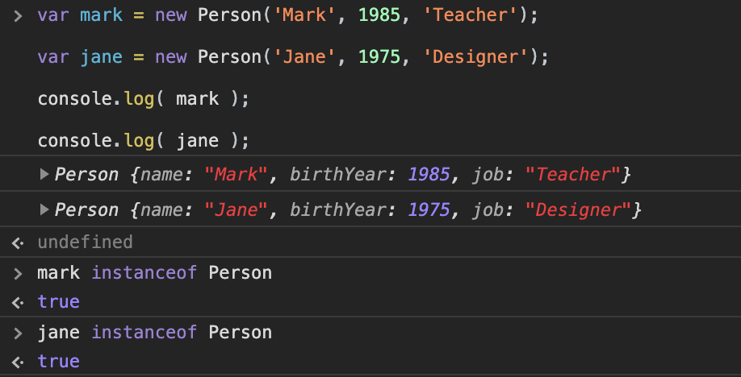

[`Programación con JavaScript`](../../Readme.md) > [`Sesión 06`](../Readme.md) > `Ejemplo 01`

---

## Ejemplo 1: Function constructor

### Objetivo

Crear constructores para instanciar objetos.

#### Requisitos

En una nueva carpeta vamos a crear un archivo `HTML` en blanco llamado `index.html`:

```html

<html lang="es">
<head>
  <title>Ejemplo 1: Function Constructor</title>
  <script type="text/javascript" src="./ejemplo-1.js"></script>
</head>
</html>
```

Dentro de la misma carpeta creamos un archivo `ejemplo-1.js` que es donde se trabajarán los ejemplos de esta
sesión. Finalmente abre el archivo `index.html` en Chrome e inspecciona la consola para ver los resultados.

#### Desarrollo

Ya mencionamos que podemos usar un constructor para crear múltiples objetos como:

```javascript
const john = {
  name: 'John',
  birthYear: 1990,
  job: 'Developer'
}
```

La forma más común de hacer esto es mediante un `function constructor`, el cual es una expresión de función como la
siguiente:

```javascript
const Person = function(name, birthYear, job) {
  this.name = name;
  this.birthYear = birthYear;
  this.job = job;
}
```

> Cuando estamos creando constructores una convención es nombrarlas con la primera letra mayúscula para diferenciar el 
> constructor de las instancias.

Vemos que este constructor recibe tres argumentos los cuales son las propiedades que queremos que tenga nuestro objeto.

```javascript
const john = new Person('John', 1990, 'Developer');
```

El operador `new` crea un nuevo objeto vacío, después se ejecuta la función `Person()`, esta es la razón por la que el
constructor utiliza `this`, está haciendo referencia al nuevo objeto vacío para asignarle las propiedades.

```javascript
console.log( john );
/*
*  {
*    name: 'John',
*    birthYear: 1990,
*    job: 'Developer'
*  }
*/
```

Hemos creado un objeto `john` el cuál es una instancia del constructor `Person`.


De esta manera podemos crear todas las instancias que sean necesarias a partir del mismo constructor.

```javascript
const mark = new Person('Mark', 1985, 'Teacher');

const jane = new Person('Jane', 1975, 'Designer');
```


