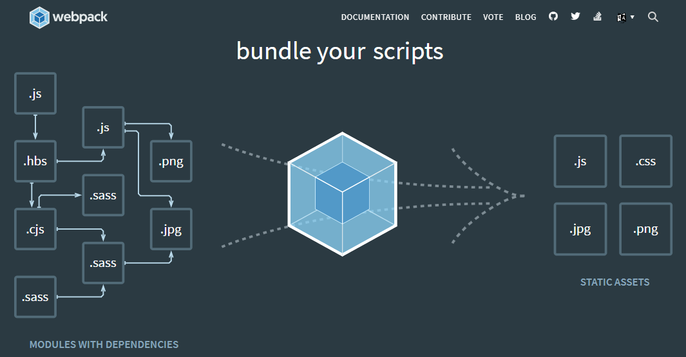

[`Programación con JavaScript`](../Readme.md) > `Sesión 08`

# Sesión 8: Webpack y Babel

## Objetivos

- Procesar aplicaciones modernas de JavaScript con Webpack para producir uno o más bundles
- Compilar las nuevas características de JavaScript en código compatible con todos los navegadores

---

## Tabla de Contenidos

- **[¿Qué es ECMAScript 6?](#qué-es-ecmascript-6)**

- **[ES6 Modules](#es6-modules)**

- **[Webpack](#webpack)**
  
  - [Ejemplo 1: Instalación y configuración](./Ejemplo-01/Readme.md)
  
  - [Webpack DevServer](#webpack-devserver)
    
  - [Ejemplo 2: Webpack DevServer](./Ejemplo-02/Readme.md)
  
  - [Loaders](#loaders)
    
  - [Reto 1: Webpack y CSS](./Reto-01/Readme.md)

- **[Babel](#babel)**

  - [Ejemplo 3: Webpack y Babel](./Ejemplo-03/Readme.md)
  
  - [Reto 2: Assets en Webpack](./Reto-02/Readme.md)

---

## ¿Qué es ECMAScript 6?

Ecma International es una organización sin ánimos de lucro encargada de regular el funcionamiento de varios estándares
en la industria de la computación. Así surge ECMAScript 1 (ES1) en 1997 como la primera versión del estándar de
JavaScript. Normalmente se usa el término ECMAScript para referirse al estándar y JavaScript para hablar del lenguaje en
la práctica.

En 2009 se lanzó ECMAScript 5 (ES5) con muchas mejoras de las versiones anteriores. Sin embargo, a los navegadores les
tomó varios años ser compatibles con esta versión.

En 2015 surge ECMAScript 2015, que también se le conoce como ES6 o ES2015. A partir de este año se decide lanzar una
nueva versión de manera anual cambiando el número del año en cada versión, es decir, ES2016, ES2017, ES2018, etc.

Actualmente la versión ES6 es compatible con la mayoría de los navegadores. Para usar características de versiones
superiores es necesario un proceso de transpiling y polyfilling que convierte el código en ES5, garantizando así la
compatibilidad del código en navegadores viejos.

---

## ES6 Modules

En JavaScript, un módulo es una unidad independiente de código que puede ser reutilizado. Los módulos permiten exponer
ciertas partes del código que serán usadas por otros módulos. Esto nos da la flexibilidad suficiente para mantener
nuestro código mejor organizado en múltiples scripts. Dada la siguiente estructura:

```
app/
  |- app.js
  |- helpers.js
```

En `helpers.js` podemos tener algunas funciones que podrán ser usadas en otras partes del código:

```javascript
const sum = (a, b) => a + b;

const multiply = (a, b) => a * b;
```

Podemos exportar cada módulo de manera independiente usando el keyword `export`.

```javascript
export const sum = (a, b) => a + b;

export const multiply = (a, b) => a * b;
```

O bien en una sola sentencia.

```javascript
const sum = (a, b) => a + b;

const multiply = (a, b) => a * b;

export { sum, multiply }
```

Para usar estas funciones en `app.js` usamos el keyword `import` junto con `from` para definir la ruta del archivo.

```javascript
import { sum, multiply } from './helpers.js'

console.log(sum(3, 2)); // 5

console.log(multiply(3, 2)); // 6
```

---

## Webpack



Webpack es una herramienta muy usada en el desarrollo de aplicaciones en JavaScript modernas. Después de procesar la
aplicación, webpack genera internamente un grafo de dependencias lo que le permite generar uno o más _bundles_. Este
_bundle_ contiene el código optimizado de todos los módulos y dependencias de tu aplicación.

Webpack solamente es capaz de transpilar los módulos de ES6 `import` y `export`, por lo que si queremos usar cualquier
otra característica de ES6+ es necesario usar un transpilador como Babel.

#### [Ejemplo 1: Instalación y configuración](./Ejemplo-01/Readme.md)

### Webpack DevServer

Con la configuración del ejemplo 1 podemos generar un bundle optimizado para producción. Sin embargo, mientras estamos
desarrollando nuestra aplicación resulta tedioso el proceso que debemos seguir cada que hagamos un cambio. 

- Generar cambios.
- Crear un nuevo bundle ejecutando `npm run build`.
- Abrir la versión dentro de `dist` en el navegador para ver los cambios.

Afortunadamente contamos con [webpack-dev-server](https://webpack.js.org/configuration/dev-server) que nos facilita el
proceso de desarrollo, ya que nos genera un servidor local que genera un bundle cada vez que realicemos cambios a
nuestro código.  

#### [Ejemplo 2: Webpack DevServer](./Ejemplo-02/Readme.md)

### Loaders

Webpack solamente entiende archivos de JavaScript y JSON. Usando _loaders_ webpack puede procesar otro tipo de archivos
y convertirlos en módulos que serán agregados al grafo de dependencias.

#### [Reto 1: Webpack y CSS](./Reto-01/Readme.md)

---

## Babel


[Babel](https://babeljs.io/) es usado principalmente para convertir código ES6+ en una versión compatible con
navegadores y ambientes tanto actuales como anteriores.

```javascript
// Babel Input: ES6 arrow function
[1, 2, 3].map((n) => n + 1);

// Babel Output: ES5 equivalent
[1, 2, 3].map(function(n) {
  return n + 1;
});
```

Las transformaciones de código que se realizan a través de _plugins_. Cada plugin le dice a babel cómo transformar el
código. Por ejemplo, el plugin `@babel/plugin-transform-arrow-functions` permite transformar arrow functions.

En lugar de agregar todos los plugins que queremos implementar uno por uno podemos usar _presets_. Estos son conjuntos
ya preestablecidos de ciertos plugins. Por ejemplo, el preset `@babel/preset-env` contiene todos los plugins necesarios
para soportar las versiones modernas de JavaScript.

#### [Ejemplo 3: Webpack y Babel](./Ejemplo-03/Readme.md)

#### [Reto 2: Assets en Webpack](./Reto-02/Readme.md)
