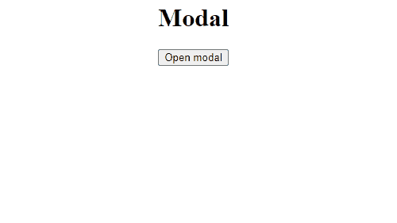

[`Programación con JavaScript`](../../Readme.md) > [`Sesión 10`](../Readme.md) > `Reto 02`

---

## Reto 2: Modal

### Objetivos

Implementar event handlers para crear un modal.

#### Requisitos

Partir del siguiente documento HTML:

```html
<html>
<head>
  <meta charset="utf8"/>
  <title>Reto 2: Modal</title>
</head>
<body>
<style>
  #modal {
    display: none;
    position: fixed;
    z-index: 1;
    padding-top: 100px;
    left: 0;
    top: 0;
    width: 100%;
    height: 100%;
    overflow: auto;
    background-color: rgb(0, 0, 0);
    background-color: rgba(0, 0, 0, 0.9);
  }

  .modal-content {
    margin: auto;
    display: block;
    width: 80%;
    max-width: 700px;
  }

  .close {
    position: absolute;
    top: 15px;
    right: 35px;
    color: #f1f1f1;
    font-size: 40px;
    font-weight: bold;
    transition: 0.3s;
  }

  .close:hover,
  .close:focus {
    color: #bbb;
    text-decoration: none;
    cursor: pointer;
  }
</style>

<h1>Modal</h1>

<button>Open modal</button>

<div id="modal">
  <span class="close">&times;</span>
  
</div>

<script>
  // Code goes here
</script>
</body>
</html>
```

#### Desarrollo

En este reto se incluyen los estilos necesarios para crear un modal, el cual se encuentra oculto por default con la
propiedad de CSS `display: none;`. 
- Al hacer click en el botón se debe mostrar un modal con una imagen.
- Usar la url `https://picsum.photos/300/200` para mostrar una imagen aleatoria. 
- Una vez abierto el modal aparece una X en la esquina superior derecha, al hacer click se debe cerrar el modal.


