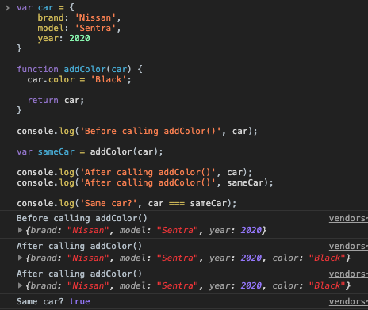
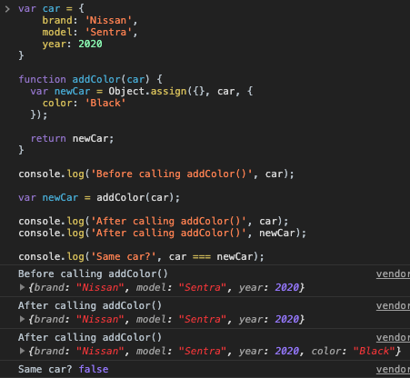

[`Programación con JavaScript`](../../Readme.md) > [`Sesión 07`](../Readme.md) > `Ejemplo 01`

---

## Ejemplo 1: Mutando objetos

### Objetivo

Crear una función que inmutable.

#### Requisitos

En una nueva carpeta vamos a crear un archivo `HTML` en blanco llamado `index.html`:

```html
<html lang="es">
<head>
  <title>Ejemplo 1: Mutando Objetos</title>
  <script type="text/javascript" src="./ejemplo-1.js"></script>
</head>
</html>
```

Dentro de la misma carpeta creamos un archivo `ejemplo-1.js` que es donde se trabajarán los ejemplos de esta
sesión. Finalmente abre el archivo `index.html` en Chrome e inspecciona la consola para ver los resultados.

#### Desarrollo

Para ver cómo funciona la inmutabilidad vamos a empezar creando un objeto que represente un carro.

```javascript
const car = {
  brand: 'Nissan',
  model: 'Sentra',
  year: 2020
}
```

Ahora vamos a crear una función que agregue la propiedad color al auto.

```javascript
function addColor(car) {
  car.color = 'Black';
  return car;
}
```

Ahora llamamos a la función pasándole el objeto `car` y guardamos en resultado en otra variable.

```javascript
console.log('Before calling addColor()', car);

const sameCar = addColor(car);

console.log('After calling addColor()', car);
console.log('After calling addColor()', sameCar);

console.log('Same car?', car === sameCar); // true
```

La función `addColor` muta el objeto `car` que recibe. La primera vez que mostramos en consola vemos que no existe la
propiedad `color`, después de llamar a la función vemos la propiedad en ambos objetos.

El objeto retornado por `addColor` es el mismo que recibió. Ambas variables, tanto `car` como `sameCar` están apuntando
al mismo objeto en memoria.



Tenemos que hacer unos cambios para que `addColor` no mute el objeto que recibe.

```javascript
function addColor(car) {
  const newCar = Object.assign({}, car, {
    color: 'Black'
  });
  return newCar;
}
```

`Object.assign()` asigna las propiedades de un objeto a otro sin modificar el objeto original. En este ejemplo está
copiando todas las propiedades de `car` en un nuevo objeto vacío `{}` y agregando la propiedad `color`.

```javascript
console.log('Before calling addColor()', car);

const newCar = addColor(car);

console.log('After calling addColor()', car);
console.log('After calling addColor()', newCar);

console.log('Same car?', car === newCar); // false
```

Como ahora la función `addColor` está creando un nuevo objeto vemos que `car` no cambia sus propiedades y el objeto
retornado es diferente al que recibe la función.


