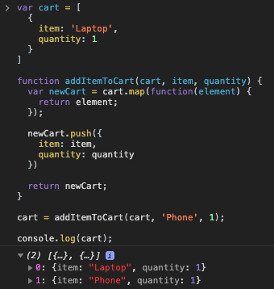

[`Programación con JavaScript`](../../Readme.md) > [`Sesión 07`](../Readme.md) > `Ejemplo 02`

---

## Ejemplo 2: Creando funciones puras

### Objetivo

Crear funciones puras.

#### Requisitos

En una nueva carpeta vamos a crear un archivo `HTML` en blanco llamado `index.html`:

```html
<html lang="es">
<head>
  <title>Ejemplo 2: Creando funciones puras</title>
  <script type="text/javascript" src="./ejemplo-2.js"></script>
</head>
</html>
```

Dentro de la misma carpeta creamos un archivo `ejemplo-2.js` que es donde se trabajarán los ejemplos de esta
sesión. Finalmente abre el archivo `index.html` en Chrome e inspecciona la consola para ver los resultados.

#### Desarrollo

En el ejemplo anterior buscamos la forma de hacer una función que no mutara el objeto que recibe.

```javascript
function addColor(car) {
  const newCar = Object.assign({}, car, {
    color: 'Black'
  });

  return newCar;
}
```

Tratando de no mutar `car` terminamos creando una función pura, como podrás ver no produce ningún efecto secundario. Es
por ello que la inmutabilidad está muy ligada a las funciones puras.

Veamos otro ejemplo. Tenemos un carrito de compras y queremos crear una función que agregue más artículos.

```javascript
const cart = [
  {
    item: 'Laptop',
    quantity: 1
  }
]
```

Como el carrito va a almacenar múltiples elementos usaremos un arreglo. Cada artículo será representado por un objeto
con dos propiedades `item` y `quantity`.

```javascript
function addItemToCart(item, quantity) {
  cart.push({
    item: item,
    quantity: quantity
  })
}
```

La solución más obvia sería usar `push()` para agregar un nuevo objeto con las propiedades `item` y `quantity`. Esta
función no es pura porque está modificando  `cart`, una variable que no se encuentra dentro de esta función. Quizás en
este ejemplo no es un problema, pero si estuviéramos haciendo una tienda en línea, es posible que otras partes de la
aplicación intenten acceder a `cart` al mismo tiempo que estamos ejecutando la función `addItemToCart` y eso sí podría
representar un problema como falta de inconsistencia en los datos.

```javascript
function addItemToCart(cart, item, quantity) {
  const newCart = cart.map(function(element) {
    return element;
  });

  newCart.push({
    item: item,
    quantity: quantity
  })

  return newCart;
}
```

> Como `map()` crea un nuevo arreglo lo podemos usar para crear una copia retornando el parámetro que recibe sin 
> modificarlo.

Una alternativa sería pasar `cart` como argumento a la función. Hacer una copia de todo el arreglo para no mutar el
original, agregar el nuevo objeto y retornar el arreglo actualizado.

```javascript
cart = addItemToCart(cart, 'Phone', 1);

console.log(cart);
```

Esta sería una forma más funcional, recuerda que en este paradigma se da prioridad a la inmutabilidad, lo que significa
crear nuevas variables que van a reemplazar a los valores antiguos.


