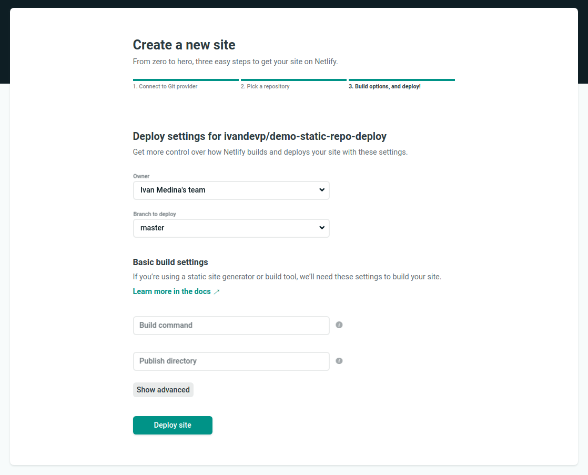
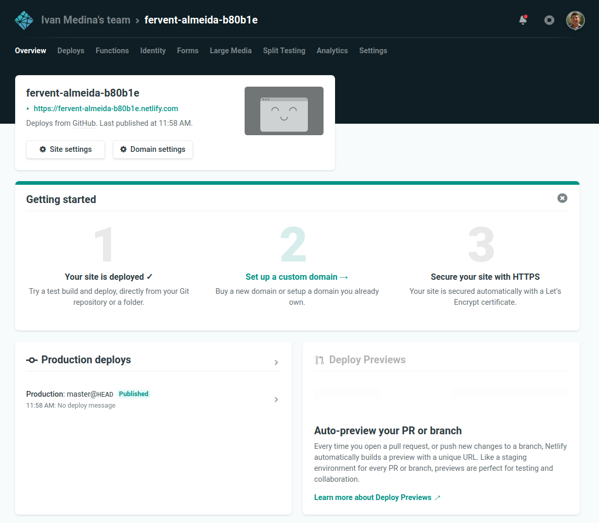

# Ej. 06 - Subiendo el proyecto a Netlify

## Objetivo

Publicar tu página web en Netlify mediante su servicio gratuito.

---
 

## Requisitos
- Tener cuenta en Netlify
- Tener un editor de código instalado

## Instrucciones

Lo primero que debemos hacer, es registrarnos en el sitio de [Netlify](https://www.netlify.com/).
Te recomendamos que utilices tu cuenta de GitHub como registro ya que en caso de
utilizar otro método, más adelante será necesario que se vincule de todas maneras.

Una vez dentro de la plataforma de Netlify con la sesión inciada, nos aparecerá
una sección llamada `Sites` mostrando una barra de búsqueda y un botón con el
texto `New site from Git`. Daremos clic a dicho botón:

Esta nos llevará a otra pantalla en la cual tendremos que seleccionar el
proveedor de proyectos basado en Git donde se encuentra nuestro repositorio.
En nuestro caso, seleccionaremos GitHub el cual estamos usando:

Una vez autorizado el acceso a nuestros repos de GitHub, nos mostrará la lista
de repositorios que tenemos en nuestra cuenta, seleccionar el del proyecto que
hemos trabajado durante la sesión de hoy. Luego nos mostrará una pantalla como
esta:

En este paso, no es necesario realizar ningún cambio ya que nuestro sitio
respeta las convenciones usadas por defecto y no usa ninguna herramienta de
optimización como veremos en futuras sesiones. Procedemos a dar clic en el botón
`Deploy site` y nos mostrará:

Aquí podrás ver que se ha generado una URL aleatoria, en la cual si le das clic,
podrás ver el resultado final:

Con esto, ya tienes tu sitio publicado en internet y un link que cualquiera
puede ver. Así que, ¡comparte con tus amigos y familiares lo que has logrado en
tu primera sesión!

> TIP: El nombre aleatorio que Netlify genera en el link es algo complejo de
> memorizar y no se ve muy amigable como para compartirlo en redes sociales,
> no te preocupes, este se puede configurar en la pantalla donde te avisó que
> tu sitio estaba listo, atrévete a experimentar y cambia el nombre del dominio
> para que se vea más cool y sea más fácil de recordar con quienes lo compartas.

  

[Regresar sesión 01](../README.md)

[Siguiente sesión 02](../../sesion-02/README.md)