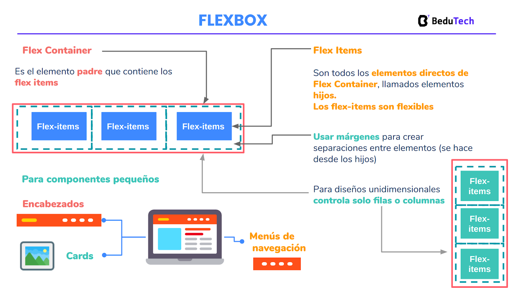

# Sesión 03: Dividiendo secciones en columnas

## Introducción

La web se distingue, respecto de otros medios, en poder presentar todo tipo de contenidos: texto, sonido, video. Es a través de estos elementos que la web puede presentar elementos que acaparan la atención del usuario y transmiten más fácilmente los conceptos que el desarrollador quiere enviar. Por ello, hoy aprenderemos cómo insertar este tipo de elementos, a utilizar un diseño más complejo con columnas.

---
 

## Objetivos

En esta sesión aprenderás:

- Agregar contenido de `video` a nuestra web.
- Cambiar el posicionamiento de los elementos HTML.
- Estructurar los elementos dentro de un `contenedor` de manera `flexible`.
- Configurar una de las tecnologías más importantes en acomodo de contenido, FlexBox.
- Usar comandos de `git` para obtener cambios realizados por `terceros`.

---
 

## Requisitos

- Git instalado
- Navegador web
- Tener instalado Visual Studio Code.
- Cuenta de Github

## Organización de la clase

- [Ejemplo 01: Creando nuestras Ramas para versiones de nuestro proyecto ( 10 minutos ) ](./Ejemplo-01/README.md)

- [Reto 01: Creando nuestras ramas / git fetch y git merge ( 20 minutos ) ](./reto-01/README.md)

- [Ejemplo 02: Agregando la etiqueta video de HTML5 ( 10 minutos ) ](./Ejemplo-02/README.md)

- [Reto 02: Agregando controles de reproducción y portada al video ( 10 minutos ) ](./reto-02/README.md)

- [Ejemplo 03: Agregando múltiples formatos de video ( 10 minutos ) ](./Ejemplo-03/README.md)

- [Reto 03: Agrega la sección de publicidad ( 10 minutos ) ](./reto-03/README.md)

- [Ejemplo 04: Alineamiento horizontal con flexbox ( 15 minutos ) ](./Ejemplo-04/README.md)

- [Reto 04: Agregando contenedor al video para agregar imagen ( 15 minutos ) ](./reto-04/README.md)

- [Ejemplo  05: Aplicando `position:fixed` ( 10 minutos ) ](./Ejemplo-05/README.md)

[Regresar](../README.md)

 

# Material Adicional

 

## Flexbox

Flexbox es un método disponible en CSS para alinear y estructurar visualmente el contenido de un elemento HTML. Flexbox nos permite usar la propiedad de **display** para indicar cuando un elemento y su contenido, en caso de tener, puede alinearse de manera flexible.

El elemento que recibe la propiedad `display: flex` se le conoce como `flex container`, mientras que a los elementos contenidos en el elemento en mención se le conoce como `flex items`.

Es posible controlar el posicionamiento del contenido desde el flex container aplicando propiedades de alineamiento tanto vertical como horizontal.

Cuando se define un flex container, sus elementos hijos (flex items) se modifican a ponerse uno al lado de otro, debido a que por defecto, el contenido toma una dirección de row (horizontal). La dirección se puede modificar a vertical a través de la propiedad flex-direction que se aplica al flex container.

A través de las propiedades `justify-content` y `align-items` se puede modificar el alineamiento de los hijos dependiendo de la dirección que estén siguiendo.

### Ejemplo:

Si quisiéramos que los flex items estén alineados al centro horizontalmente, esto se podría lograr con `justify-content: center;` siempre y cuando el `flex-directio`n sea row.

Puesto que `justify-content` alinea a los flex items en el eje principal, mientras que `align-items` lo hace en el eje secundario. Por lo tanto, notar en el ejemplo anterior que si el `flex-direction` fuera column(vertical) para alinear horizontalmente, necesitaríamos usar la propiedad `align-items`.

 

 

## `position: fixed`

La propiedad `position` con el valor de `fixed` es muy útil, esto debido a que esta propiedad position permite que el elemento al que se le aplica, salga del flujo normal de la web.